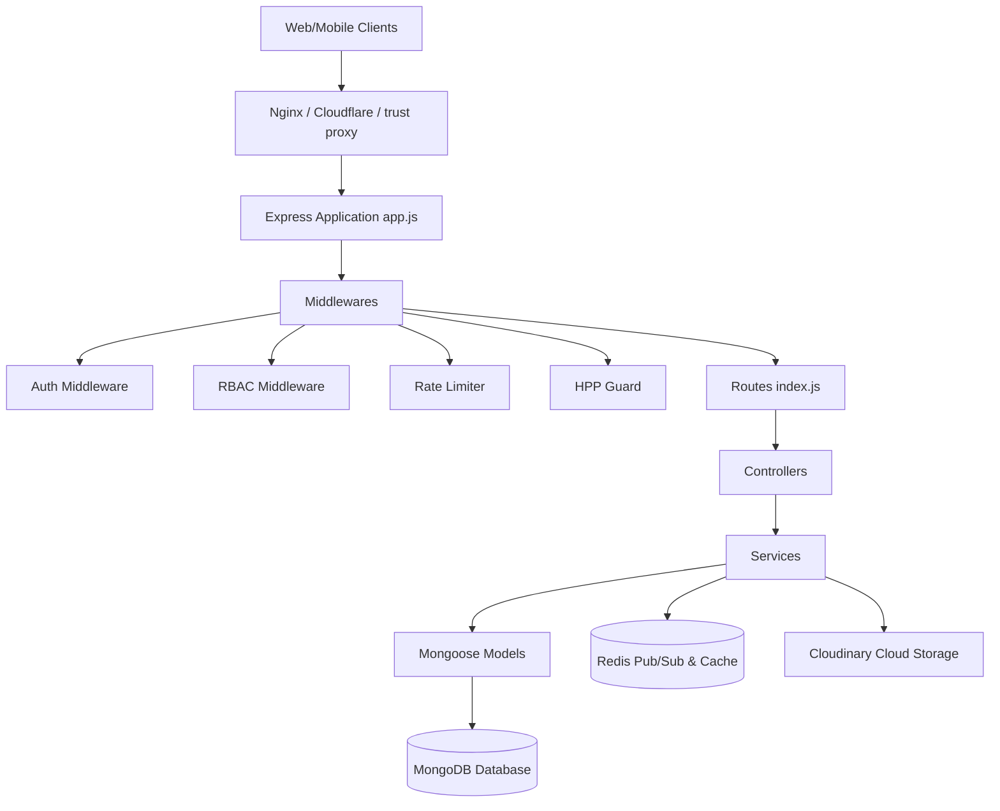
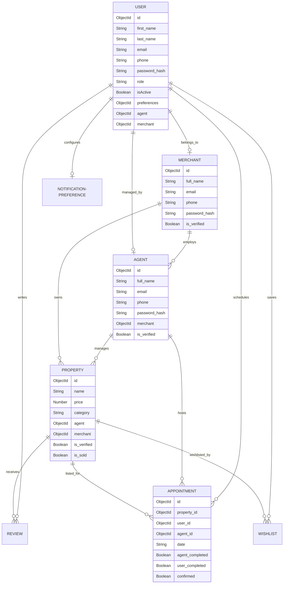
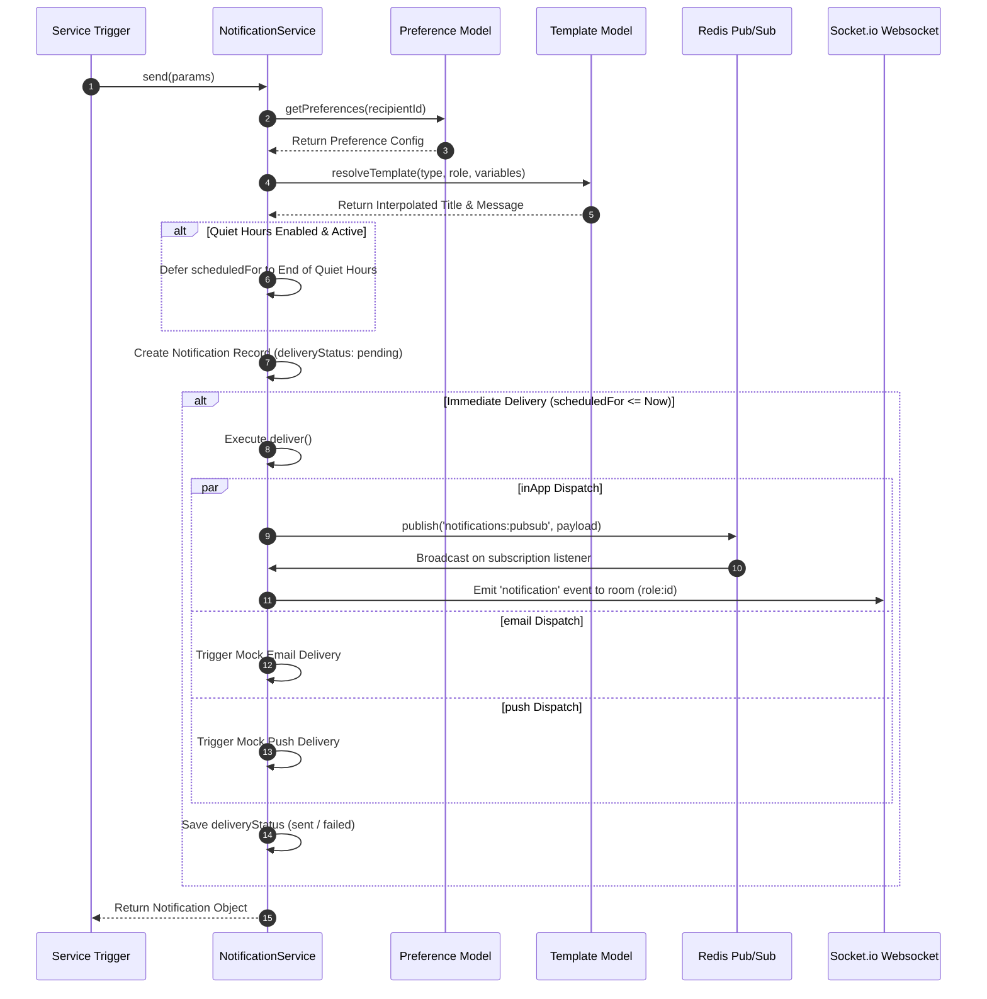

# Codebase Documentation: Property API

This document provides a comprehensive technical overview of the **Property API** codebase, detailing the system architecture, component design, complete API routes, the problem space the application solves, and key trade-offs made during its development.

---

## 1. Executive Summary & Problem Space

The **Property API** is an enterprise-grade RESTful API designed to power real estate management platforms. Real estate ecosystems are complex, requiring coordination among multiple actors under strict security, trust, and real-time messaging requirements.

### Core Problems Solved
1. **Multi-Role Entity Ecosystem**: Handling permissions and workflows for four distinct classes of actors:
   - **Users (Buyers/Renters)**: Browse properties, schedule tours, leave reviews, and purchase listings.
   - **Agents**: List properties, manage clients, and coordinate viewing tours.
   - **Merchants (Brokerages/Agencies)**: Onboard, verify, and supervise agents, and review properties listed under their organization.
   - **Admins (Platform Moderators)**: Ban/unban users/IPs, verify merchants/properties, moderate reviews, and broadcast platform alerts.
   - **Guests**: Browse properties anonymously, request alerts, and maintain local-storage session configurations.
2. **Anti-Fraud & Trust Verification**:
   - Listings cannot go public without **Admin verification** (`is_verified` flag).
   - Agents must be verified by their parent **Merchant** before being allowed to list.
   - Restricting CRUD capabilities based on verified relationships (e.g., an agent can only modify their own property; a merchant can modify any property managed by their agency's agents).
3. **Showings/Inspections Verification Loop**:
   - Double-loop verification for physical tours: both the `User` and the `Agent` must explicitly mark the inspection as completed (`user_completed` and `agent_completed`).
4. **Intelligent Event & Notifications Handling**:
   - Routing events (such as showing requests, new leads, and price drops) to dynamic target channels (In-App, Email, Push, SMS) based on complex template interpolation rules, user preferences, and timezone-aware quiet hours.
5. **High Availability and Scalability**:
   - Maintaining system uptime and graceful fallback behavior if database or Redis instances fail.
   - Supporting horizontal scaling (multi-instance setup) for WebSockets.

---

## 2. System Architecture & Component Design

The application follows a **layered, service-oriented MVC architecture** structured as follows:

### Component Breakdown

1. **Routing Layer (`src/routes/`)**: Versioned under `/v1/*`, routing maps URI endpoints to controller handlers. It isolates the route registration from the controller logic.
2. **Middleware Layer (`src/middlewares/`)**:
   - **Authentication (`authenticate.js`)**: Decodes JWT and injects `req.actor` (including `id`, `role`, and `merchant_id`). Provides an optional authentication check for public-facing search endpoints.
   - **RBAC Guard (`rbac.middleware.js`)**: Dynamically verifies permissions and cross-actor relationships. For example, it prevents an agent from reading notifications triggered by another user unless they are linked by a scheduled viewing or property.
   - **Security Protections**:
     - `cookieSecurity.js`: Enforces `httpOnly`, `secure`, and `sameSite` cookie rules.
     - `requestTimeout.js`: Rejects requests that hang longer than 5000ms.
     - `rejectDuplicateQueryParams.js`: Prevents HTTP Parameter Pollution (HPP) by rejecting requests with duplicate query parameters.
     - `rateLimiter.js`: Enforces distributed rate limiting using the **Token Bucket** algorithm via Redis (with an in-memory Map fallback). Sets standard RFC rate limit headers (`RateLimit-Limit`, `RateLimit-Remaining`, `RateLimit-Reset`).
3. **Controller Layer (`src/controllers/`)**: Extracts request bodies, parameters, and query fields, delegates the business execution to services, and wraps responses in a standard JSON envelope using `ApiResponse`.
4. **Service Layer (`src/services/`)**: The core business logic layer. Services perform database operations, manage cache keys, perform image compression via `sharp`, and upload static assets.
5. **Database Models (`src/models/`)**: Structured schemas using Mongoose. Includes indexes on geospatial coordinates (`lat`, `lng`), compound keys for notification delivery statuses, and TTL indexes for auto-expiring notifications.

---

## 3. Detailed Data Models & Relationships

The database utilizes Mongoose to manage schemas. Relationships are maintained using object references (`ObjectId`).

### Core Schema Configurations
* **User & Roles**: Roles include `USER`, `AGENT`, `MERCHANT`, `ADMIN`, and `GUEST`. Guests can access specific notification capabilities using a `guestSessionId`. User profiles can be isolated under an `AGENT` or `MERCHANT` by establishing `agent` or `merchant` reference links.
* **Database Index Optimizations**:
  - **Property Indexes**: Indexed on `{ city: 1, is_verified: 1, createdAt: -1 }` (compound index supporting sorted list queries) and `{ lat: 1, lng: 1 }` (geospatial searches).
  - **Appointment Indexes**: Compound indexes `{ agent_id: 1, date: -1 }` and `{ user_id: 1, date: -1 }` to support high-performance client showing calendar retrievals, and `{ property_id: 1 }`.
  - **Review Indexes**: Compound index `{ property_id: 1, createdAt: -1 }` for low-latency sorted feedback streams, and `{ user_id: 1 }`.
  - **Token Purge TTL**: Auto-purges expired password reset tokens using a TTL index on `{ expires_at: 1 }` with `expireAfterSeconds: 0`. The token verification looks up a unique index on `{ token: 1 }`.
* **Notification System**:
  - `Notification`: Auto-deletes after the expiration date via a TTL index: `notificationSchema.index({ expiresAt: 1 }, { expireAfterSeconds: 0 })`.
  - `NotificationPreference`: Configures notification channels (`inApp`, `email`, `push`, `sms`) and quiet hours (e.g., `start: "22:00"`, `end: "07:00"`, `timezone: "UTC"`).
  - `NotificationTemplate`: Stores patterns such as `messageTemplate: 'The property "{property_title}" you tracked just dropped to {new_price}!'` for dynamic replacement.

---

## 4. Key Subsystem Workflows

### 4.1 Notification Pipeline & Quiet-Hours Engine

The notification engine is highly robust, integrating user preferences, templating, quiet-hours, and real-time delivery.

### 4.2 Local Image Compression & Cloudinary Storage
When an agent or user uploads assets (like property images or avatars), the API processes the request via `upload.middleware.js` using `multer` in-memory buffers:
1. **Compression**: Utilizes `sharp` (`imageCompressor.js`) to downscale image size (e.g., limit width to 1200px) and convert it to modern WebP format with `quality: 80`.
2. **Uploading**: Streams the compressed buffer directly to Cloudinary via a promise wrapper (`cloudinary.js`).
3. **Fallback**: If Cloudinary parameters are missing, it defaults to retaining the buffer locally.

### 4.3 Query Caching & Cache Stampede Protection
The Property API implements a cache-aside query caching mechanism for properties (lists and detail views) via `cacheHelper.js`'s `getOrSetCache` function.
* **Distributed Locking (NX/PX)**: To prevent **Cache Stampede** (where multiple parallel requests on a cache miss simultaneously query the database and exhaust resources), the helper attempts to acquire an atomic lock key using `SET lock:key 1 NX PX 5000`. Only the thread acquiring the lock fetches from the database and updates the cache; other threads wait and retry (up to 20 attempts).
* **Random Jitter**: Staggers key expiration to avoid concurrent expirations by adding/subtracting a random jitter (+/- 5% of the TTL).
* **Tag-based Cache Invalidation**: Key queries (e.g. property lists) are tagged (e.g., `properties:list`). When mutating actions occur (creation, update, verification, delete, buy), all keys associated with the tag are invalidated, ensuring real-time data consistency.

### 4.4 Distributed Token Bucket Rate Limiter
Global API and authentication routes are protected by a custom, distributed rate limiter implemented via `createTokenBucketLimiter` in `rateLimiter.js`.
* **Atomic Lua Script Evaluation**: Rates are computed atomically using a Lua script executed directly on Redis. This checks token count, applies refills based on time elapsed since the last request, and decrements tokens in a single transaction.
* **In-Memory Fallback & GC**: If Redis becomes disconnected or is in fallback mode, the limiter automatically falls back to an in-memory `Map` store. A garbage collection interval periodically runs on the fallback `Map` to prune inactive rate limit buckets and prevent memory leaks.
* **RFC-Compliant Headers**: Every limited route returns standard headers: `RateLimit-Limit`, `RateLimit-Remaining`, and `RateLimit-Reset`.

### 4.5 Agent Client Management & Directory Isolation
To support agency and tenant isolation, the system implements a strict access validation framework:
* **Privilege Escalation Prevention**: New users registered via public routes are locked to the `USER` role. Only an authenticated `ADMIN` can assign elevated roles (`AGENT`, `MERCHANT`, `ADMIN`).
* **Creator Association**: When an `AGENT` or `MERCHANT` creates a client account, the user is linked via `agent` or `merchant` properties.
* **Access Isolation (`verifyUserAccess`)**: Reads/writes to user profiles, wishlists, and properties are guarded by a relationship verification engine. An agent can only access users they either created or have an active showing tour scheduled with. A merchant can only access users belonging to their brokerage firm.

---

## 5. Complete API Routes Table

All routes are prefixed with `/v1`. Auth and guest routes are publicly accessible, while others enforce JWT authentication and RBAC checks.

| Module | HTTP Method | Endpoint | Auth Required | Actor Role Allowed | Description |
| :--- | :--- | :--- | :--- | :--- | :--- |
| **System** | `GET` | `/health` | No | Any | Checks system and database connection health |
| | `GET` | `/api-docs` | No | Any | Renders the interactive Swagger UI documentation |
| **Auth** | `POST` | `/v1/token` | No | Any | Issues a JWT guest token |
| | `POST` | `/v1/auth/login` | No | Any | Logs in a user, agent, or merchant; returns JWT |
| | `POST` | `/v1/auth/forgot-password` | No | Any | Generates a password reset token and returns it (redacted in non-test modes) |
| | `POST` | `/v1/auth/reset-password` | No | Any | Validates reset token and updates the user's password |
| **Properties** | `GET` | `/v1/properties` | Optional | Any | Lists properties with filters (city, type, price, etc.) |
| | `GET` | `/v1/properties/:id` | Optional | Any | Retrieves detailed information of a property listing |
| | `POST` | `/v1/properties` | Yes | `AGENT`, `MERCHANT`, `ADMIN` | Creates a property listing (sets `is_verified: false` by default) |
| | `PUT` | `/v1/properties/:id` | Yes | `AGENT`, `MERCHANT`, `ADMIN` | Updates property parameters (non-admins cannot edit `is_verified`) |
| | `PUT` | `/v1/properties/:id/resource` | Yes | `AGENT`, `MERCHANT`, `ADMIN` | Handles image upload arrays (max 5 WebP images) |
| | `PUT` | `/v1/properties/:id/set-verified` | Yes | `ADMIN` | Directly updates property verification status |
| | `POST` | `/v1/properties/buy` | Yes | `USER` | Marks a property as sold (`is_sold: true`) |
| | `DELETE`| `/v1/properties/:id` | Yes | `AGENT`, `MERCHANT`, `ADMIN` | Deletes a property listing (enforces owner validations) |
| **Users** | `GET` | `/v1/users` | Yes | `ADMIN`, `MERCHANT`, `AGENT` | Lists users (filtered by role scope and relations) |
| | `POST` | `/v1/users` | Optional | Any | Creates/registers a user profile (links to creator) |
| | `GET` | `/v1/users/:user_id` | Yes | Owner or `ADMIN` | Gets a user profile |
| | `PUT` | `/v1/users/:user_id` | Yes | Owner or `ADMIN` | Updates a user's details |
| | `PUT` | `/v1/users/:user_id/resource` | Yes | Owner or `ADMIN` | Uploads a user's avatar image |
| | `DELETE`| `/v1/users/:user_id` | Yes | Owner or `ADMIN` | Deletes a user profile |
| | `GET` | `/v1/users/:user_id/wishlist` | Yes | Owner or `ADMIN` | Gets a list of properties saved by the user |
| | `GET` | `/v1/users/:user_id/properties` | Yes | Owner or `ADMIN` | Retrieves properties managed or owned by this actor |
| | `POST` | `/v1/users/wishlist` | Yes | `USER`, `ADMIN` | Adds a property to the user's wishlist |
| **Merchants** | `GET` | `/v1/merchants` | Optional | Any | Lists all merchants |
| | `POST` | `/v1/merchants` | No | Any | Registers a new merchant organization |
| | `GET` | `/v1/merchants/agents` | Optional | Any | Lists agents employed under the merchant |
| | `POST` | `/v1/merchants/agents` | Yes | `MERCHANT`, `ADMIN` | Creates/onboards a new agent under the merchant |
| | `POST` | `/v1/merchants/verify-agent`| Yes | `MERCHANT`, `ADMIN` | Verifies a sub-agent (sets `agent.is_verified: true`) |
| | `GET` | `/v1/merchants/:id/wishlist` | Yes | `MERCHANT`, `ADMIN` | Gets the merchant's saved properties |
| **Agents** | `GET` | `/v1/agents` | Optional | Any | Lists all agents |
| | `POST` | `/v1/agents` | Optional | Any | Creates an agent profile |
| | `PUT` | `/v1/agents/:id/resource` | Yes | Agent or `ADMIN` | Uploads/updates agent avatar |
| | `GET` | `/v1/agents/:id/wishlist` | Yes | Agent or `ADMIN` | Retrieves the agent's saved listings |
| | `DELETE`| `/v1/agents/:id` | Yes | Agent or `ADMIN` | Deletes an agent profile |
| **Appointments**| `GET`| `/v1/appointments` | Yes | Any | Lists scheduled tours (filtered by ownership) |
| | `POST` | `/v1/appointments` | Yes | `USER`, `ADMIN` | Schedules a tour (triggers alert to Agent) |
| | `PUT` | `/v1/appointments/:id` | Yes | Owner or `ADMIN` | Updates tour details |
| | `PUT` | `/v1/appointments/:id/confirm-meeting`| Yes| Agent or `ADMIN` | Confirms the meeting appointment |
| | `PUT` | `/v1/appointments/:id/set-agent-appointment-completion`| Yes| Agent or `ADMIN` | Marks appointment as completed by the agent |
| | `PUT` | `/v1/appointments/:id/set-user-appointment-completion`| Yes| User or `ADMIN` | Marks appointment as completed by the user |
| | `DELETE`| `/v1/appointments/:id` | Yes | Owner or `ADMIN` | Cancels/deletes a scheduled viewing tour |
| **Reviews** | `GET` | `/v1/reviews` | Optional | Any | Lists reviews for properties |
| | `POST` | `/v1/reviews` | Yes | `USER`, `ADMIN` | Creates a new review for a property listing |
| | `PUT` | `/v1/reviews/:id` | Yes | Reviewer or `ADMIN` | Updates a review |
| | `DELETE`| `/v1/reviews/:id` | Yes | Reviewer or `ADMIN` | Deletes a property review |
| **Notifications**| `GET`| `/v1/notifications` | Yes | Any (incl. Guest) | Lists notifications (filtered to own session) |
| | `PATCH`| `/v1/notifications/:id/read` | Yes | Owner or `ADMIN` | Marks a notification as read |
| | `PUT` | `/v1/notifications/preferences` | Yes | Any except Guest | Updates notification preferences and quiet hours |
| | `POST` | `/v1/admin/notifications/broadcast`| Yes| `ADMIN` | Sends platform-wide system notification |
| **Admin** | `GET` | `/v1/admin/dashboard` | Yes | `ADMIN` | Retrieves high-level dashboard metrics |
| | `GET` | `/v1/admin/metrics` | Yes | `ADMIN` | Returns server performance metrics (CPU, RAM) |
| | `GET` | `/v1/admin/users` | Yes | `ADMIN` | Lists all users |
| | `GET` | `/v1/admin/users/search` | Yes | `ADMIN` | Searches user profiles |
| | `GET` | `/v1/admin/users/:id` | Yes | `ADMIN` | Gets details of a user |
| | `PATCH`| `/v1/admin/users/:id` | Yes | `ADMIN` | Updates user parameters |
| | `DELETE`| `/v1/admin/users/:id` | Yes | `ADMIN` | Deletes user profile |
| | `POST` | `/v1/admin/users/:id/ban` | Yes | `ADMIN` | Bans a user profile (sets `isActive: false`) |
| | `POST` | `/v1/admin/users/:id/unban` | Yes | `ADMIN` | Unbans a user profile (sets `isActive: true`) |
| | `PATCH`| `/v1/admin/users/:id/role`| Yes | `ADMIN` | Modifies user roles |
| | `PATCH`| `/v1/admin/merchants/:id/verification`| Yes| `ADMIN` | Verifies merchant status |
| | `POST` | `/v1/admin/merchants/:id/verify`| Yes | `ADMIN` | Alternative path to verify merchant status |
| | `GET` | `/v1/admin/properties` | Yes | `ADMIN` | Lists all properties (including unverified ones) |
| | `POST` | `/v1/admin/properties/:id/approve`| Yes| `ADMIN` | Approves a property (sets `is_verified: true`) |
| | `POST` | `/v1/admin/properties/:id/reject`| Yes| `ADMIN` | Rejects/unverifies a property listing |
| | `POST` | `/v1/admin/properties/:id/flag`| Yes | `ADMIN` | Flags a property listing |
| | `GET` | `/v1/admin/flagged-content` | Yes | `ADMIN` | Lists flagged properties/reviews |
| | `POST` | `/v1/admin/moderation-rules` | Yes | `ADMIN` | Creates content moderation guidelines |
| | `GET` | `/v1/admin/audit-logs` | Yes | `ADMIN` | Lists administrative audit trails |
| | `GET` | `/v1/admin/reports` | Yes | `ADMIN` | Lists generated system reports |
| | `POST` | `/v1/admin/reports` | Yes | `ADMIN` | Triggers a new system report generation |
| | `GET` | `/v1/admin/reports/:id/export`| Yes| `ADMIN` | Exports system reports (CSV/JSON/PDF) |
| | `PATCH`| `/v1/admin/config` | Yes | `ADMIN` | Updates global settings (maintenance mode, size limits) |
| | `GET` | `/v1/admin/system-status` | Yes | `ADMIN` | Details system parameters |
| | `GET` | `/v1/admin/feature-flags` | Yes | `ADMIN` | Lists configuration feature flags |
| | `PATCH`| `/v1/admin/feature-flags` | Yes | `ADMIN` | Updates features (enables beta features) |
| | `POST` | `/v1/admin/backups` | Yes | `ADMIN` | Schedules a database backup task |
| | `GET` | `/v1/admin/backups` | Yes | `ADMIN` | Lists completed/queued backups |
| | `POST` | `/v1/admin/backups/:id/restore`| Yes| `ADMIN` | Restores the database from a backup |
| | `POST` | `/v1/admin/email-templates` | Yes | `ADMIN` | Configures transactional email templates |
| | `POST` | `/v1/admin/email-templates/:id/test`| Yes| `ADMIN` | Dispatches a test template email |
| | `POST` | `/v1/admin/api-keys` | Yes | `ADMIN` | Generates a platform API key |
| | `DELETE`| `/v1/admin/api-keys/:id` | Yes | `ADMIN` | Revokes a platform API key |
| | `GET` | `/v1/admin/api-keys/:id/usage`| Yes| `ADMIN` | Returns utilization logs of an API key |
| | `POST` | `/v1/admin/webhooks` | Yes | `ADMIN` | Creates event webhooks |
| | `POST` | `/v1/admin/webhooks/:id/test`| Yes | `ADMIN` | Fires a mockup payload to verify target webhook URL |
| | `GET` | `/v1/admin/webhooks/:id/logs`| Yes | `ADMIN` | Retrieves webhook response history logs |
| | `GET` | `/v1/admin/health` | Yes | `ADMIN` | Quick system component status check |
| | `GET` | `/v1/admin/logs` | Yes | `ADMIN` | Streams server log output |
| | `PATCH`| `/v1/admin/rate-limits` | Yes | `ADMIN` | Modifies default request rate limits |
| | `GET` | `/v1/admin/rate-limits/stats`| Yes | `ADMIN` | Returns current IP rate limit stats |
| | `POST` | `/v1/admin/banned-ips` | Yes | `ADMIN` | Adds an IP to the server blacklisted ban list |
| | `DELETE`| `/v1/admin/banned-ips/:id` | Yes | `ADMIN` | Removes an IP from the blacklist |
| | `GET` | `/v1/admin/analytics` | Yes | `ADMIN` | Returns business metrics |

---

## 6. Architectural Trade-offs & Engineering Decisions

When reviewing the structure of the application, several trade-offs between architectural complexity, performance, and robustness stand out.

### 6.1 Fallback-Mode Caching & Resilience
* **Decision**: Built checks (`mongoose.connection.readyState !== 1` and `fallbackMode`) directly into the `RedisService` and database query layers. If Redis or MongoDB is disconnected, the server automatically switches to no-op fallback handlers rather than hard crashing.
* **Why**: Ensures high resilience. During development, developers can start the Express API without needing Redis or local MongoDB servers running, utilizing mocked database structures where needed. In production, this prevents a single caching node failure from taking down the entire API.
* **Trade-off**: Silences potential connection failures. In production, if Redis goes down, the API will continue to serve requests, but performance will degrade due to direct database reads, and WebSocket pub/sub features will fail. Strict health monitoring (`/health`) is required to capture this.

### 6.2 Separate Collections for Actors (Users, Agents, Merchants)
* **Decision**: Kept Users, Agents, and Merchants in separate database collections, rather than merging them into a unified `User` model with dynamic fields.
* **Why**: Strict schema isolation. Agents contain fields (like a reference to `Merchant` and `is_verified` flags) that have no semantic meaning for regular Users. Separating them keeps documents clean and ensures validations (e.g., email uniqueness) are isolated to each entity class.
* **Trade-off**: Complicates authentication and centralized user searches. When a request hits `/auth/login` without an explicit `actor_type`, the backend must perform sequential queries across three separate collections (`User`, `Agent`, and `Merchant`) to resolve the entity. This creates a minor CPU/database overhead during the authentication handshake.

### 6.3 Local Image Processing vs. Background Workers
* **Decision**: Image compression via `sharp` is performed synchronously on the API node during the request lifecycle.
* **Why**: Simplifies architecture and deployment overhead. By processing images in-memory and converting them to WebP instantly before streaming to Cloudinary, there is no need to deploy and monitor distributed job queues (like RabbitMQ, BullMQ, or Celery) and worker instances.
* **Trade-off**: Under heavy loads, CPU utilization on the main API server can spike significantly. Since Node.js is single-threaded, extensive image processing tasks can block the event loop, causing request latency to increase for other users. If scale increases, asset processing should be offloaded to an asynchronous background worker queue or Serverless Functions.

### 6.4 Dynamic Quiet-Hours Calculation
* **Decision**: Calculated quiet-hours offsets dynamically inside `NotificationService.send()` via Javascript's `Intl.DateTimeFormat` timezone engine.
* **Why**: Avoids setting up database cron triggers or external scheduling pipelines (like Redis Keyspace notifications) for standard alert deferrals.
* **Trade-off**: Deferring notifications relies on computing dates in-memory during requests. If a system failure or restart occurs, deferred/scheduled notifications that reside strictly in the memory event stack can be lost. To mitigate this, notification states are stored in the database with a `scheduledFor` date stamp, allowing a cron task to pick up and process outstanding items.

### 6.5 Strict HTTP Parameter Pollution (HPP) Prevention
* **Decision**: Rejected any request containing duplicate query parameters (`rejectDuplicateQueryParams.js`) globally.
* **Why**: Mitigates security risks. HPP attacks occur when query arrays are passed to backend parameters that expect singular strings, leading to SQL/NoSQL injection or application errors.
* **Trade-off**: Rejects standard array queries in query strings (e.g., `?category=LAND&category=DUPLEX` is rejected). To support filtering by multiple values, the client must format parameters as comma-separated values (e.g., `?category=LAND,DUPLEX`), which requires custom parsing in the services layer.

### 6.6 Distributed Rate Limiting vs. Local Memory Fallback
* **Decision**: Implemented an atomic Lua script-based Token Bucket rate limiter in Redis with a local Map-based in-memory fallback.
* **Why**: Promotes horizontal scalability. With multiple running instances of the API, rate limits must be tracked globally. The Lua script evaluates limits atomically in Redis. If Redis crashes, the fallback Map prevents API down-time by falling back gracefully to local limits.
* **Trade-off**: Memory fallback introduces local state. If the API scales horizontally and Redis goes down, clients can exceed their rate limits across multiple server instances because each instance only tracks limits locally on its own memory Map. Additionally, the periodic garbage collection interval introduces small CPU overhead.

### 6.7 Cache Stampede Protection Locks
* **Decision**: Wrapped database queries on cache misses with a Redis SET-NX lock inside `getOrSetCache`.
* **Why**: High-load resilience. When a popular cache key expires, thousands of concurrent requests would otherwise hit MongoDB at once, potentially causing a database lockup.
* **Trade-off**: Increases caching lookup latency. Clients that make requests while another process has the lock are delayed (sleeping 50ms per check, up to 20 retries). If lock release fails or the process hangs, other requests will block until they hit the retry limit before falling back to the database.

### 6.8 Multi-Tenant Isolation & Access Validation Overhead
* **Decision**: Implemented relationship checks via `verifyUserAccess` in `user.service.js` rather than purely relying on role checks in route authorization.
* **Why**: Allows fine-grained multi-role directory isolation. Agents and merchants cannot see users/clients unless they have established relationships (agent creator, merchant employer, or appointment).
* **Trade-off**: Substantial database query overhead. For every single read, write, or update of a user profile, the API must query MongoDB to find the target user, and if they are an agent, perform additional checking (such as querying the `Appointment` collection for active showings). This is mitigated by lean database queries and select projections, but scales linearly with client-agent volume.
